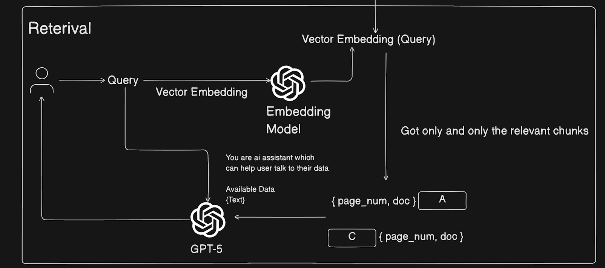

# Prompting
#### Zero-shot Prompting: You give the task directly, no examples.
Example: “Write a LinkedIn post about the importance of customer feedback.”

#### Few-shot Prompting: You give a few examples first, then ask for a similar output.
Example:
“Example 1: …
Example 2: …
Now write a similar post about customer feedback.”

#### Chain-of-Thought (CoT) Prompting: You encourage step-by-step reasoning before the final answer.
Example: “Solve this math problem and show your reasoning step by step.”

#### Self-Consistency Prompting: You ask the model to generate multiple answers and pick the best/most consistent one.
Example: “Generate 5 solutions to this problem, then choose the most consistent final answer and explain why.”

#### Instruction Prompting: You specify rules/format/style the model must follow.
Example: “Write a product description in 3 bullet points, max 12 words each, include 1 emoji.”

#### Direct Answer Prompting: You demand a short answer with no explanation.
Example: “Answer in one sentence only: What is SEO?”

#### Persona-based Prompting: You tell the model to respond like a specific professional/personality.
Example: “Act like a senior startup mentor and advise me on fundraising strategy.”

#### Role-Playing Prompting: The model takes a role in an interactive scenario (conversation).
Example: “You are an investor. Interview me as a founder. Ask one question at a time.”

#### Contextual Prompting: You provide background info so the output fits your situation better.
Example: “My startup is a B2B SaaS for fleet management in Germany. Write an email to workshops…”

#### Multimodal Prompting: You combine text + images (or other inputs) for the task.
Example: “Here’s my UI screenshot—suggest improvements and write the updated microcopy.”

 
 
 
 

# Prompt Serialization Styles
### 1. Alpaca Prompt

    ### Instructions: <System_prompt> \n
    ### Input: <User_query>
    ### Response:\n

### 2. ChatML format - OpenAI, Gemini

    
    {
        "role":"system" | "user" | "assistant", 
        "content":"string"
    }

### 3. INST Prompting

    [INST] user_query [/INST]

# RAG
1. Indexing phase

2. Retriveal
